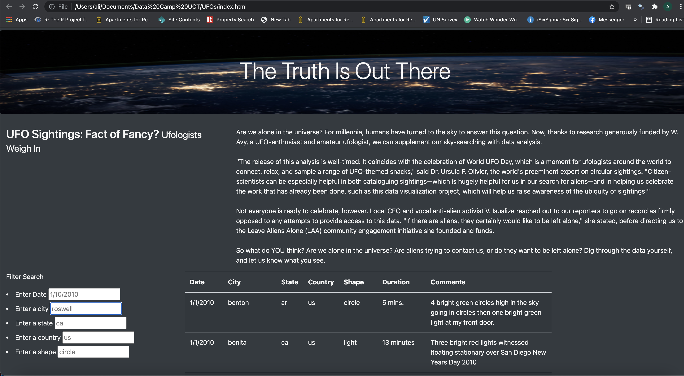

# UFOs
## **Overview of UFO Sighting Web Application**

**Purpose:** 
    The UFO sighting web application provides a platform for UFO enthusiats to search and retrieve information about the UFO sighting events. Users of this application are able to inser search creteria and retireve the list of sightings. 

**Objectives:** 
    The overarching objectives and related deliverables for this development are the followings:

- Filter UFO sightings on multiple criteria:
1. Date of sighting UFO
2. City
3. State
4. Country 
5. Shape of UFO

- Display the search result in a list embeded in web application

**Resources:**
1. Data Source: data.js
2. Software: Visual Studio Code 1.38.1, Java Script, HTML, CSS

**Results:**
    
1. The web app is succesfully developed to include all the search creteria. This applcation can be used by inserting individual or multiple search creteria and updates the list of UFO sighting based on the given search creteria. All changes are applied as the text changes inside the input box and list is updated as soon as user gives the search creteria.

        
**Summary:**

UFO sighting app can be further enhanced by using predefined list of drop down menue for input fields inorder to restrict the search creteria to available data.

In addition a plotly chart to show the sightings count by date as well as leaflet map to pinpoing the sightings. Both of these can give user a better insight to data by providing an interactive visulizations.
